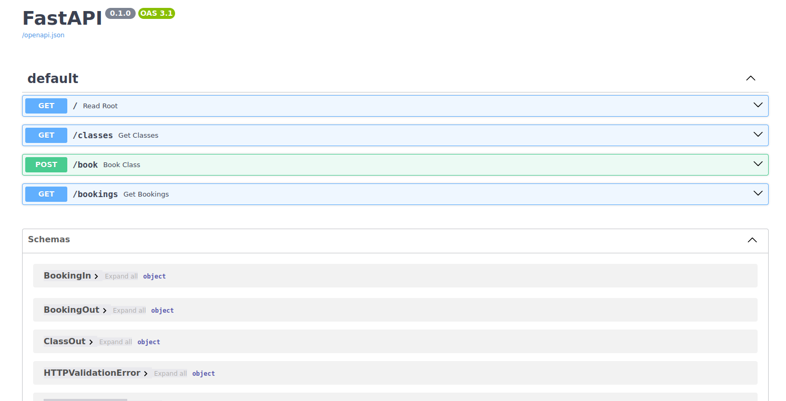
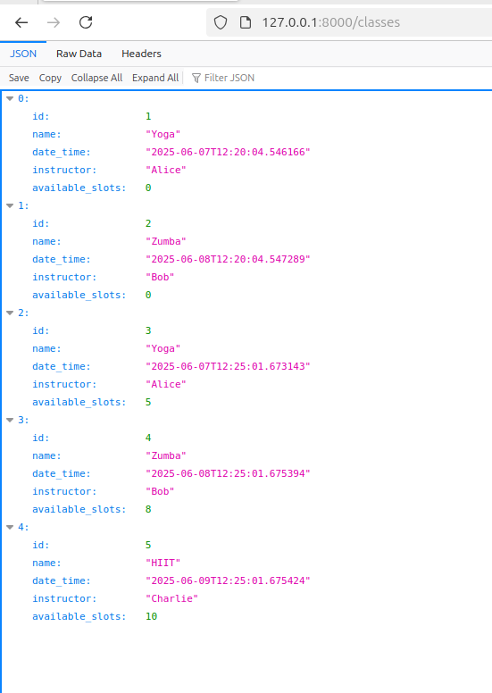

# Fitness Booking API
A simple booking API for a fitness studio like Yoga, Zumba and HIIT.

## Key Features
- **Class Management** - View all available fitness classes with instructor details, schedules, and slot availability
- **Real-time Booking** - Book fitness class slots with automatic availability tracking and slot decrementing
- **Email-based Lookup** - Retrieve all bookings by client email address for easy booking management
- **Data Validation** - Input validation using Pydantic schemas with email format verification
- **SQLite Database** - Lightweight database storage with SQLAlchemy ORM for data persistence
- **RESTful API** - Clean REST endpoints with proper HTTP status codes and error handling
- **Interactive Documentation** - Auto-generated API docs available at /docs endpoint
- **Timezone Support** - Built-in timezone conversion utilities for standardized time handling
- **Booking Protection** - Prevents overbooking with automatic slot availability checks
- **Thread-safe Operations** - Multi-threaded database connections for concurrent request handling

## Technology Stack
- **Backend Framework:** FastAPI 
- **Database:** In-Memory Sqlite Database
- **Deployment Platform:** 
  - Source Code- Github 
  - Application - Render

## Setup
- Download the source code into your preferred folder and move into it
```
git clone https://github.com/Jade-py/Fitness-Booking-API.git <your_project_folder_name>
cd <your_project_folder_name> 
```

- Create and activate a virtual environment to isolate your project from rest of the system
```
python3 -m venv env
source env/bin/activate
```

- Install all the dependencies

`pip install -r requirements.txt`

- Seed the database with sample data

`python3 -m app.seed`

- Start the server

`uvicorn app.main:app`

## Gallery

- A descriptive and interactive Swagger UI for documentation



- All the classes for a particular instructor



- All the listed bookings


